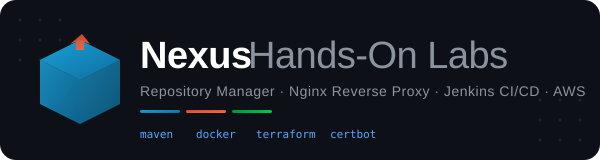

<p align="center">
  
</p>

<p align="center">
  <strong>Artifact Management · Reverse Proxy · CI/CD Pipelines</strong>
</p>

<p align="center">
  
  
  
  
  
  
</p>

---

## Overview

This repository contains a series of progressive hands-on labs for **Sonatype Nexus Repository Manager** on AWS. Starting from a bare EC2 instance, you'll build up to a production-grade artifact management platform with HTTPS termination and automated CI/CD pipelines.

Each lab builds on the previous one — by the end, you'll have a fully working system where Jenkins builds a Java application, publishes the artifact to Nexus, fetches it back, and deploys it — all behind an Nginx reverse proxy with a free Let's Encrypt SSL certificate.

---

## Architecture

```
                          ┌─────────────────────────────────────────────┐
                          │              AWS Cloud (us-east-1)          │
                          │                                             │
  Developer / Browser     │   ┌──────────────┐     ┌────────────────┐   │
  ───── HTTPS :443 ──────►│   │    Nginx      │────►│  Nexus Server │   │
                          │   │ Reverse Proxy │     │   :8081       │   │
                          │   │ + Let's Encrypt│    │   (Maven,     │   │
                          │   └──────────────┘      │    Docker)    │   │
                          │                         └───────▲───────┘   │
                          │                                 │           │
                          │   ┌──────────────┐              │           │
                          │   │   Jenkins    │──── deploy ──┘           │
                          │   │   :8080      │     publish / fetch      │
                          │   └──────────────┘                          │
                          └─────────────────────────────────────────────┘
```

---

---

## Labs

| #      | Lab                                                          | Description                                                                                       | Key Topics                                                                       |
| ------ | ------------------------------------------------------------ | ------------------------------------------------------------------------------------------------- | -------------------------------------------------------------------------------- |
| **01** | [Nexus Repository Setup](./Nexus-01-Maven-Docker-Repo/)      | Install Nexus on EC2, create Maven (proxy, hosted, group) and Docker (proxy, hosted) repositories | Nexus installation, systemd, Maven settings.xml, Docker insecure registries      |
| **02** | [Reverse Proxy with Nginx](./Readme-1-Reverse-Proxy.md)      | Place Nginx + Let's Encrypt in front of Nexus for HTTPS access                                    | Nginx config, Certbot, TLS termination, DNS A records, security groups           |
| **03** | [CI/CD with Jenkins & Nexus](./Readme-2-ci-cd-with-nexus.md) | Build → Publish → Fetch → Deploy pipeline using Jenkins, Maven, and Nexus                         | Jenkinsfile, Maven deploy lifecycle, credentials management, artifact resolution |

> **Prerequisite chain:** Lab 01 → Lab 02 → Lab 03. Each lab assumes the previous infrastructure is already running.

---

---

## Prerequisites

- An **AWS account** with permissions to launch EC2 instances
- A **domain name** with DNS access (for Let's Encrypt SSL)
- **SSH key pair** for EC2 access
- Basic familiarity with **Linux**, **Maven**, and **Docker**

---

## Tech Stack

| Tool                        | Role                                                 |
| --------------------------- | ---------------------------------------------------- |
| **Sonatype Nexus 3**        | Artifact repository for Maven JARs and Docker images |
| **Nginx**                   | Reverse proxy with TLS termination                   |
| **Let's Encrypt / Certbot** | Free, auto-renewing SSL certificates                 |
| **Jenkins**                 | CI/CD pipeline orchestration                         |
| **Maven**                   | Java build tool & dependency management              |
| **Docker**                  | Container image build & registry interaction         |
| **AWS EC2**                 | Compute platform (Amazon Linux 2023)                 |
| **Terraform**               | Infrastructure provisioning (Jenkins server)         |

---

## Quick Reference

### Default Ports

| Service                | Port   | Access                            |
| ---------------------- | ------ | --------------------------------- |
| Nexus Web UI           | `8081` | Internal only (via reverse proxy) |
| Docker Proxy Registry  | `8082` | Internal                          |
| Docker Hosted Registry | `8083` | Internal                          |
| Nginx HTTP             | `80`   | Public (redirects to 443)         |
| Nginx HTTPS            | `443`  | Public                            |
| Jenkins                | `8080` | Public or via reverse proxy       |

### Key File Paths

```
/opt/nexus/                          # Nexus installation
/opt/sonatype-work/nexus3/           # Nexus data directory
/etc/nginx/conf.d/nexus.conf         # Nginx reverse proxy config
/etc/letsencrypt/live/<domain>/      # SSL certificates
/home/ec2-user/.m2/settings.xml      # Maven settings
```

---

## What You'll Learn

- **Artifact Management** — Proxy, hosted, and group repository patterns for Maven and Docker
- **Reverse Proxy Architecture** — Why and how to put Nginx in front of application servers
- **TLS/SSL in Practice** — Obtaining and auto-renewing certificates with Let's Encrypt
- **CI/CD Fundamentals** — Building a complete Jenkins pipeline that integrates with Nexus
- **Security Best Practices** — Credentials management, security groups, and shredding sensitive files
- **Infrastructure Thinking** — Connecting multiple services across EC2 instances in a real AWS environment

---

## Author

**Ogulcan Erdag**
DevOps & Cloud Engineering

[](https://ogulcan-erdag.com)
[](https://github.com/OgulcanErdag)

---
